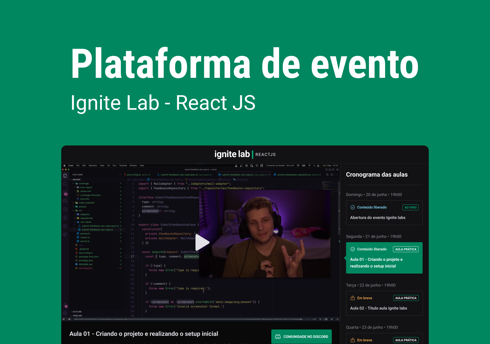

  <a href="#-tecnologias">Tecnologias</a>&nbsp;&nbsp;&nbsp;|&nbsp;&nbsp;&nbsp;
  <a href="#-projeto">Projeto</a>&nbsp;&nbsp;&nbsp;|&nbsp;&nbsp;&nbsp;
  <a href="#-layout">Layout</a>&nbsp;&nbsp;&nbsp;

    

## 🚀 Tecnologias

- ReactJS
- TypeScript
- Tailwind
- Graphql
- Apollo

## 💻 Projeto

Projeto desenvolvido no Ignite Lab, que ocorreu nos dias 19 a 26 de junho.

## 🔖 Layout

Você pode visualizar o layout do projeto através [desse link](https://www.figma.com/community/file/1120711251998877938). É necessário ter conta no [Figma](https://figma.com) para acessá-lo.

<h5 align="center"><a href="https://ignite-lab-react-rakelmm.vercel.app/">ACESSE AQUI O PROJETO FINAL</a></h5>

---

Feito com ❤️ por Rakel Moreira!